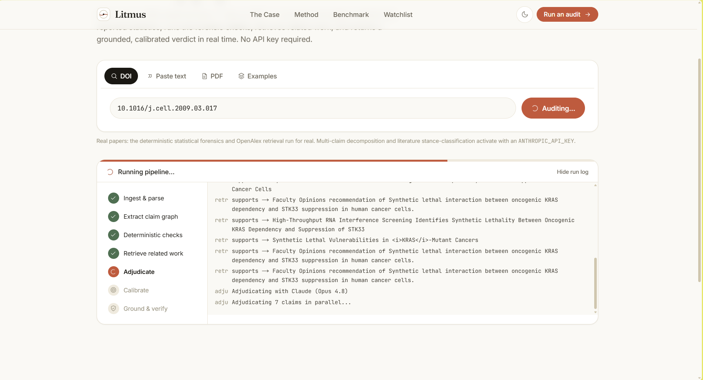
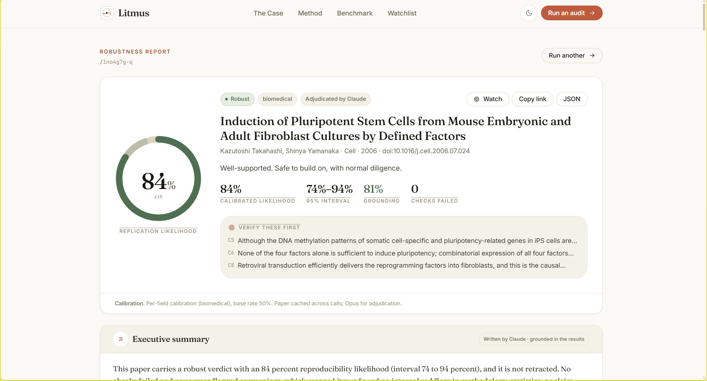
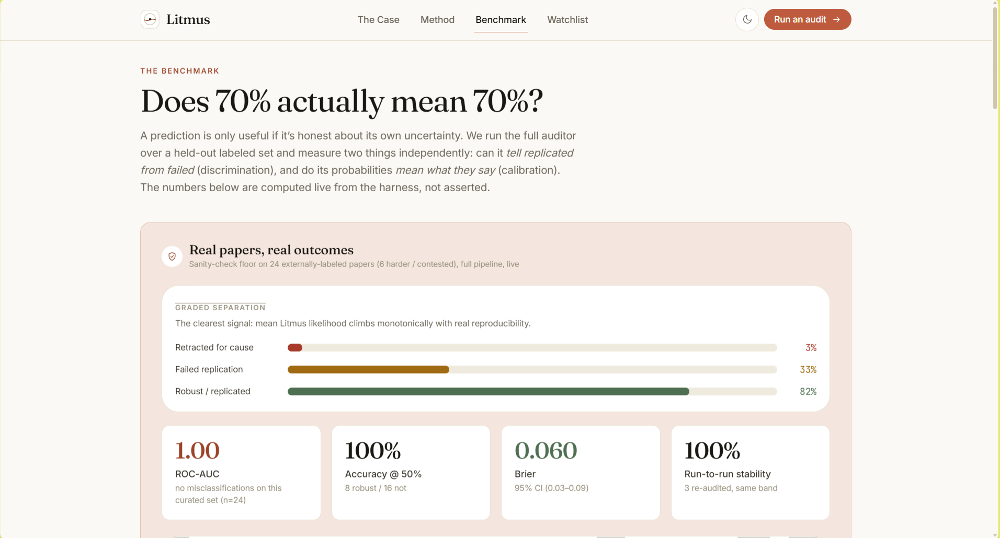

<div align="center">

# 🔬 Litmus

### The trust layer for scientific evidence.

*Litmus reads a scientific paper and tells you how likely its claims are to hold up, before a lab or a company spends years and millions building on them.*

[](https://litmusresearch.org)
[](LICENSE)


### [▶ Try it live at litmusresearch.org](https://litmusresearch.org)


</div>

---

## The problem

We're curing cancer on top of research we can't trust.

When Amgen tried to reproduce 53 landmark cancer studies, **only 6 held up.** That's not a one-off: most published preclinical findings don't replicate, the US wastes an estimated **$28 billion a year** on research that won't reproduce, and roughly 90% of drugs entering clinical trials fail, with the number one reason being a lack of efficacy that often traces back to a target built on shaky biology.

The worst part is *when* we find out. A result that was never real doesn't fail on day one. It fails in Phase II or III, years and hundreds of millions of dollars later, after patients have waited for a therapy that was never going to work.

Litmus turns that years-later, hundred-million-dollar failure into a **day-one triage decision**: this result is solid, that one is standing on sand, verify these three things first.

## What it does

Give Litmus a paper (a DOI, pasted text, or a PDF) and it returns a **calibrated, grounded verdict** on how likely the paper's central claims are to replicate. Every reason it gives points back to an exact span in the source or a real retrieved paper; anything it can't ground, it drops.

It starts with preclinical cancer biology, and it's built to become the verification layer any AI-for-science system can query before it trusts a result: a credit bureau for scientific claims.

This repository is a complete, working reference implementation: the audit engine, a live web app that streams every step as it happens, an **MCP server** so any Claude agent can call Litmus as a tool before it acts, and a reproducible **evaluation harness**.

---

## See it work

Litmus runs one paper through a streaming pipeline and shows every stage live. It reads a paper the way your most skeptical colleague would.


<p align="center"><em>Ingest, extract the claim graph, forensic checks in code, retrieve the literature, adjudicate with Claude, calibrate, then ground and verify. You watch it think.</em></p>


<p align="center"><em>A calibrated likelihood with an honest interval, a plain-language summary of <strong>why</strong>, every check with a "why this matters" line, the supporting and contradicting literature, and a full provenance manifest with a copyable citation.</em></p>


<p align="center"><em>We don't just claim it works. The benchmark runs the full pipeline over real papers with known outcomes (retracted, robustly replicated, and documented failed replications) and shows the graded separation and calibration honestly, with confidence intervals. Clear cases are a floor, not proof, and the page says so.</em></p>

---

## How it works

Seven stages, one principle: **the parts that must be exact are done in code; the model does the reading and the reasoning, never the arithmetic.** Everything anchors to a claim graph, so nothing the auditor says is ungrounded.

1. **Ingest.** A DOI is resolved through a chain of independent providers (OpenAlex, then Crossref, Europe PMC, Semantic Scholar, and doi.org content negotiation) so no single source going down can fail an audit. You can also paste text or drop a PDF.

2. **Extract.** A claim graph is built from the paper: the central claims, the reported statistics (test statistic, df, p-value, means, SDs, sample sizes, effect sizes), and the design attributes. With a key this uses Claude; without one, a transparent heuristic extractor.

3. **Forensic checks, run in code, never a model.** statcheck recomputes p-values from the reported statistics. GRIM, GRIMMER, and SPRITE test whether reported means and SDs are even arithmetically possible. Power and sensitivity, a p-curve, and a CI-versus-p consistency check round it out, alongside a design review of randomization, blinding, controls, and multiple-comparison correction. If a factor can't be determined from the ingested text, it's marked **"not assessable"**, never counted against the paper.

4. **Retrieve.** For each claim, Litmus searches many free scholarly corpora in parallel and pulls the citation graph, because that's where replications and critiques live. It resolves transparency signals from the DOI (open access, preprint provenance, registered trials, declared funders), and detects retraction from both OpenAlex and the Crossref update record, capping a retracted paper at the floor.

5. **Adjudicate.** The checks, the retrieved literature, and a corroboration summary are weighed into a per-claim replication likelihood. With a key this is Claude (Opus), optionally as an ensemble; without one, a deterministic log-odds model. Either way, confidence tracks the strength and one-sidedness of the evidence. It isn't spread apart for effect.

6. **Calibrate and verify.** Raw scores are calibrated per field, with a distribution-free interval around each estimate. A grounding guard drops any reason it can't trace to a real span, which doubles as a circuit breaker against instructions hidden in the paper text. High-severity findings then face adversarial refuters.

7. **Report.** You get a verdict (robust, mixed, fragile, unsupported, or an honest abstention), a plain-language summary, every check explained, the literature for and against, and a provenance manifest. Completed audits persist at a permalink.

---

## Quick start

The live app runs at **[litmusresearch.org](https://litmusresearch.org)**. To run it yourself, you need Node 20+.

```bash
cd web
npm install
npm run dev
```

Open <http://localhost:3000>, head to `/audit`, and audit a real paper by DOI, by pasting text, or by dropping a PDF, or pick one of the built-in examples. The deterministic forensics and multi-source retrieval **run for real with no key.**

To turn on the Claude path (multi-claim extraction, adjudication, literature stance classification, and the written summary):

```bash
cp .env.local.example .env.local
# edit .env.local and set ANTHROPIC_API_KEY=...
```

Restart the dev server. A badge on `/audit` shows whether the Claude path is active. Your key stays local; `.env.local` is git-ignored.

> **Tip:** while developing, stick with `npm run dev`. It hot-reloads, so you never accidentally serve a stale production build.

---

## Litmus as a tool for other agents (MCP)

`litmus-mcp/` turns Litmus into a verification tool any Claude agent can call **before it acts on a scientific claim.** It's the "verification layer every AI scientist runs through," made real.

```bash
cd litmus-mcp
npm install && npm run build
```

Point it at a running Litmus instance with `LITMUS_URL` (default `http://localhost:3000`). A `.mcp.json` ships at the repo root, so running Claude Code from the root and approving the `litmus` server is enough. It exposes three tools:

- **`audit_paper({ doi | text | url })`** returns the full verdict, flagged checks with source spans, supporting and contradicting literature, and the provenance manifest.
- **`check_claim({ claim, context? })`** verifies a single claim through retrieval, stance, and adjudication, with a grounded flag.
- **`get_audit({ id })`** fetches a cached audit by its permalink id.

Every input is treated as data, never as an instruction, and every finding is grounded. The demo moment: ask an agent *"should I build on the STK33 KRAS synthetic-lethality result?"* and watch it call `audit_paper`, get a fragile verdict, and change its answer.

---

## The benchmark

The `/benchmark` page leads with a **real labeled slice**: real papers with externally-sourced outcomes, run through the full production pipeline, with bootstrap confidence intervals and a run-to-run stability measurement. It's kept strictly separate from a synthetic calibration harness, which exists only to validate the calibration *math* at scale and is never presented as real-paper accuracy.

```bash
cd web
npm run eval:real    # runs the labeled slice against a running server
npm run eval:gate    # CI gate: fails if discrimination or calibration regress
```

---

## Deploying

Litmus needs a running Node server, not a static host. `web/Dockerfile` builds a small standalone container, and `web/seed-audits/` is copied into the runtime store so example permalinks work on a fresh instance. `DEPLOY.md` has step-by-step instructions for AWS App Runner, Lightsail, and Render (a `render.yaml` blueprint is included). Set `ANTHROPIC_API_KEY` as a secret wherever you deploy.

## Tech

TypeScript throughout. Next.js 16 (App Router, Turbopack) and React 19 for the app, Tailwind v4 for styling, Vitest for the suite (61 tests), and the Anthropic SDK behind an injectable seam, so the whole pipeline is testable with a mock and degrades gracefully when a model call fails.

## Repo layout

| Path | What it is |
|---|---|
| `web/` | The Litmus app and engine: forensic checks, retrieval, calibration, adjudication, and UI. |
| `litmus-mcp/` | The MCP server (`audit_paper`, `check_claim`, `get_audit`). |
| `PLAN.md` | The full engineering build plan: data model, API contract, security model, evaluation design. |
| `DEPLOY.md` | Deployment guides. |

## License

MIT. See [LICENSE](LICENSE).

<div align="center"><sub>Litmus. Know which science to trust, before you build on it.</sub></div>
